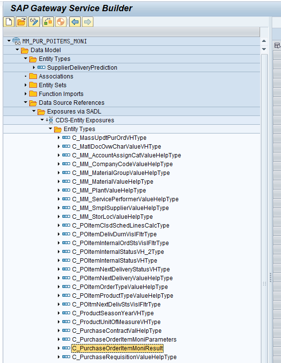

# Anwendungsbeispiel CDS Erweiterung

In diesem Anwendungsbeispiel von CDS View Erweiterungen soll ein kundeneigenes Feld aus einem Z Append an der Tabelle `ekpo` im CDS View Modell bekannt gemacht werden. Ziel ist die Einbindung des zusätzlichen Feldes in die Fiori Anwendung [Monitor Purchase Order Items](https://fioriappslibrary.hana.ondemand.com/sap/fix/externalViewer/#/detail/Apps(%27F2358%27)/S26OP).

## CDS Views finden

1. In der [Fiori Apps Library](https://fioriappslibrary.hana.ondemand.com/) die zu erweiternde App öffnen und für die passende Zielsystemversion im Reiter `Implementation Information` den Bereich `Configuration` ausklappen. Unter der Überschrift `OData Service(s)` ist der zugrundeliegende OData Service der App gelistet. Dieser folgt meist dem Schema `*_SRV`.
2. Öffne das Serviceobjekt in Eclipse über die Funktion `Open ABAP Development Object` (Shortcut `Strg+Shift+A`). Das Serviceobjekt heißt dabei meist wie der OData Service ohne den Suffix `_SRV`. Der OData Service der Beispielanwendung lautet `MM_PUR_POITEMS_MONI_SRV`, das zugehörige Serviceobjekt `MM_PUR_POITEMS_MONI`.
3. In der sich öffnenden Transaktion sind die zugrundeliegenden CDS Views in der Baumstruktur unter `Data Model` ↦ `Data Source Reference` ↦ `Exposures via SADL` ↦ `CDS-Entity Exposures` ↦ `Entity Types`. Die korrekte CDS View kann beispielsweise über die Browserkonsole gefunden werden. Grundsätzlich folgt die zu suchende CDS View dem Namensschema `C_*Type`. Wenn es sich wie im Beispiel um eine analytische Anwendung handelt, gibt es zwei Einträge für die zu suchende CDS View `C_*Parameters` und `C_*Result`. 
4. Der Name der CDS View entspricht dem angezeigtem Namen ohne die Suffixe `Type`, `Parameters` oder `Result`.

## CDS View analysieren

1. Öffne die gefundene CDS View (im Beispiel `C_PurchaseOrderItemMoni`) inm Eclipse  über die Funktion `Open ABAP Development Object` (Shortcut `Strg+Shift+A`).
2. Prüfe, ob die CDS View eine `C0` Freigabe besitzt. Öffne dafür in Eclipse den Reiter `Properties` ↦ `API State`. Wenn die `C0` Freigabe von SAP erteilt wurde, kann die CDS View automatisch über das Key User Tool [Custom Fields](https://fioriappslibrary.hana.ondemand.com/sap/fix/externalViewer/#/detail/Apps('F1481')/S26OP) oder händisch über CDS View Erweiterungen upgradesicher erweitert werden. Nicht freigegebene CDS Views können nur über CDS View Erweiterungen erweitert werden. Dabei ist in der Architektur auf updatesicherheit zu achten. Die Consumption View aus der Beispielanwendung besitzt die `C0` Freigabe.
3. In einer freigegebenen CDS View existiert immer eine Assoziation zur Extension Include View des Datenmodells. Diese assoziierte View folgt dem Namensschema `E_<Bezeichnung der Entität>` mit eventuell vorgestelltem Namensraum. In der Beispielview sieht diese Einbindung wie folgt aus:

```cds
define view C_PurchaseOrderItemMoni
  with parameters
    @Consumption.valueHelpDefinition: [{ entity: { name : 'I_Currency', element : 'Currency' } }]
    P_DisplayCurrency : vdm_v_display_currency

  as select from P_PurchaseOrderItemMntr(P_DisplayCurrency: $parameters.P_DisplayCurrency) as PurchaseOrderItem

  association [1..1] to E_PurchasingDocumentItem       as _PurchasingDocumentItemExt   on  $projection.PurchaseOrder     = _PurchasingDocumentItemExt.PurchasingDocument
                                                                                       and $projection.PurchaseOrderItem = _PurchasingDocumentItemExt.PurchasingDocumentItem
```

## Extension Include View erweitern

Die Extension Include View wird von SAP standardmäßig in alle `C0` freigegebenen CDS Views eingebunden, sodass eine upgradesichere Erweiterung aller zum Datenmodell gehörigen CDS Views unabhängig von der View Hierarchie möglich wird. Eine Extension Include View greift dabei immer direkt auf die zugrunde liegende Datenbanktabelle zu und verwendet zumeist den Alias `Persistence` für diese Datenbanktabelle. Die CDS View enthält standardmäßig lediglich die Schlüsselfelder der Datenbanktabelle.

Die Extension Include View des Beispiels lautet `E_PurchasingDocumentItem` und ist unter S/4HANA 2022 wie folgt aufgebaut.

```cds
@ObjectModel.usageType.dataClass: #TRANSACTIONAL
@ObjectModel.usageType.serviceQuality: #A 
@ObjectModel.usageType.sizeCategory: #L
@AbapCatalog.sqlViewName: 'EMMPURDOCITM'
@VDM.viewType: #EXTENSION
@AccessControl.authorizationCheck: #PRIVILEGED_ONLY 
@EndUserText.label: 'Extension view for Purchasing Document Item'
define view E_PurchasingDocumentItem as select from ekpo as Persistence {
  key Persistence.ebeln as PurchasingDocument,
  key Persistence.ebelp as PurchasingDocumentItem
}  
```

1. Im ersten Schritt wird nun das kundeneigene Feld der Extension Include View über eine CDS View Erweiterung hinzugefügt. Lege dafür ein neues Entwicklungsobjekt vom Typ `Data Definition` an. Der Name sollte der Namenskovention `<Namensraum>_X<Name der Extension Include View>` folgen. Für unser Beispiel im Namensraum `ZEXT_` also `ZEXT_XE_PurchasingDocumentItem`. Beim Anlegen der CDS View Erweiterung kann im letzten Schritt des Anlagewizards das Template `extendView` bzw. `extendViewEntity` gewählt werden.
2. (nur bei DDIC basierten CDS View Erweiterungen) SQL View Append Name angeben. Hier muss eine Kurzform des View Erweiterung Namen angegeben werden, der sich von dem CDS View Namen unterscheidet. SQL View Append Name für unser Beispiel `ZEXTXEPDI`.
3. Im Extend Teil der Definition muss die zu erweiternde CDS View angegeben werden. In unserem Beispiel also `ZEXT_XE_PurchasingDocumentItem`. 
4. Innerhalb der Projektionsliste können nun die kundeneigenen Felder hinzugefügt werden. Dabei sollte ein aus Businesssicht verständlicher und lesbarer Aliasnamen in CamelCase Schreibweise gewählt werden.
5. Nach dem Aktivieren der CDS View Erweiterung kann die Funktionalität durch Öffnen der Extension Include View in der Data Preview überprüft werden. Bei richtiger Vorgehensweise sind hier nun am Ende die neuen Spalten sichtbar.

CDS View Erweiterung für das Beispiel:

```cds
@AbapCatalog.sqlViewAppendName: 'ZEXTXEPDI'                                               // Schritt 2
@EndUserText.label: 'CDS Extension Demo'
extend view E_PurchasingDocumentItem with ZEXT_XE_PurchasingDocumentItem                  // Schritt 3
{
  Persistence.zz_ext_demo as ExtensionDemoField                                           // Schritt 4
}
```

```cds
extend view I_BusinessPartner with ZXI_BusinessPartner
{
  but000.zz_append_field as MyAppendField
}
```

## Basic Interface View erweitern

Dieser Schritt ist optional sollte aber in einer sauberen Umsetzung immer durchgeführt werden. Die Erweiterung der Basic Interface View des Datenmodells ermöglicht die spätere Nutzung des kundeneigenen Feld auch in auf CDS basierenden, kundeneigenen Anwendungen und Datenmodellen.

1. Zunächst muss die Basic Interface View des Datenmodells gefunden werden. Sie ist zumeist namensgleich mit der Extension Include View beginnt im Unterschied zu dieser aber nicht mit `E_` sondern mit `I_`. In unserem Beispiel lautet der Name der Basic Interface View `I_PurchasingDocumentItem`.
2. Lege erneut eine CDS View Erweiterung an, die diesmal die Basic Interface View erweitert. Namensschema: `<Namensraum>_X<Name der Basic Interface View>` z.B. `ZEXT_XI_PurchasingDocumentItem`.
3. Da in der Basic Interface View bereits eine Assoziation zur Extension Include View besteht, kann das kundeneigene Feld über diese Assoziation hinzugefügt werden.

> **Hinweis:** Die Aktivierung von CDS View Erweiterungen kann je nach Umfang des Datenmodells mehrere Stunden dauern.

CDS View Erweiterung für das Beispiel:

```cds
@AbapCatalog.sqlViewAppendName: 'ZEXZXIPDI'
@EndUserText.label: 'Erweiterung Basic View'
extend view I_PurchasingDocumentItem with ZEXT_XI_PurchasingDocumentItem
{
    _ItemExtension.ExtensionDemoField
}
```

## Consumption View erweitern

Die Erweiterung der Consumption View fügt das neue Feld dem OData Service hinzu und erfolgt analog zu der Erweiterung der Basic Interface View.

In unserem Beispiel heißt die CDS View Erweiterung der Consumption View `ZEXT_XC_PurchaseOrderItemMoni`.

```cds
@AbapCatalog.sqlViewAppendName: 'ZEXZXCPOMI'
@EndUserText.label: 'Erweiterung Basic View'
extend view C_PurchaseOrderItemMoni with ZEXT_XC_PurchaseOrderItemMoni
{
    @UI.lineItem:{ position: 100 }    // Beispiel einer Annotation
    _PurchasingDocumentItemExt.ExtensionDemoField
}
```

Dem Feld können über Annotationen Metadaten beispielsweise zum Beeinflussen von Fiori Elements Anwendungen mitgegeben werden. Die genauen Annotationen können den Schulungsunterlagen entnommen werden.
